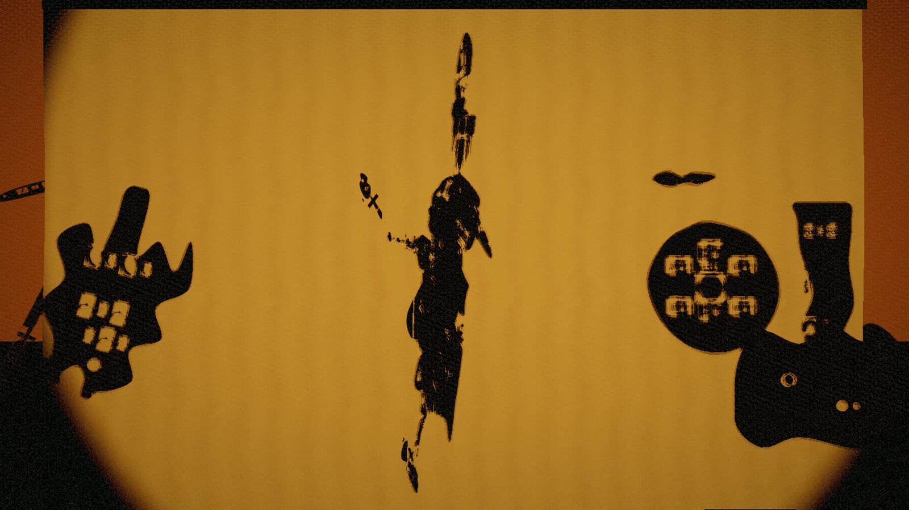
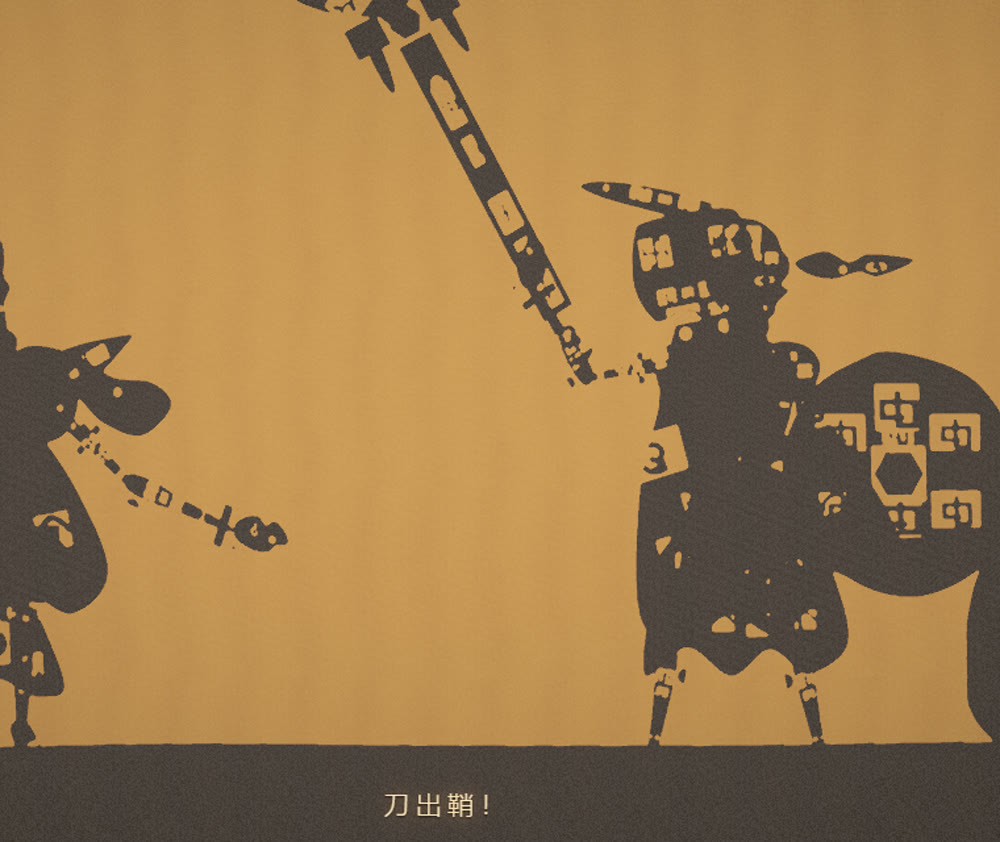
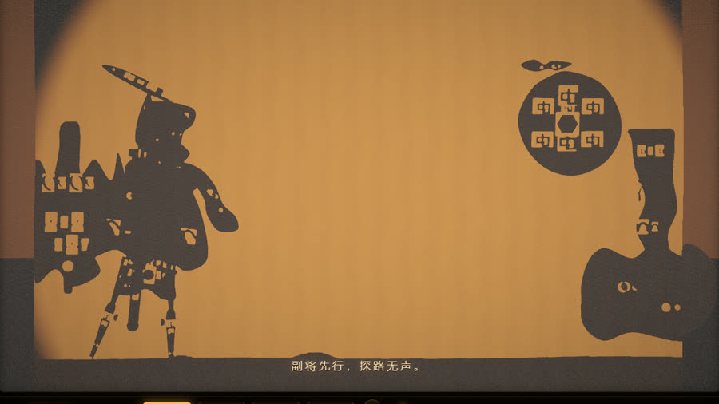

# piying-engine

**WebGL2 shadow-puppet rendering engine** · 真实阴影贴图 · 镂空透光 · 关节树 · 织物幕布



把「灯在幕布后面，观众看剪影」这件事**真的算出来**的渲染引擎。

不是把剪影贴上去：每个部件都是真实遮挡体，从灯的视角渲染进 2048² 阴影贴图。
幕布上的影子是「光被挡住」的结果，**镂空花纹是「光穿过孔洞」的结果**。

`three.js r160` · 零位图资源 · 零第三方依赖的验证链

---

## 效果

| 镂空透光（甲片 / 花窗 / 刀身血槽都真的透光） | 起 · 上灯入场 |
|---|---|
|  |  |

> 以上是**同一个引擎**渲染的完整作品《影窗·夜巡》。本仓库的 `example/` 是同一套 API 写的
> **最小示例**（从零拼一个会动的小人），可读性优先，造型刻意做得简单。

---

## 它解决什么

做「幕布后面的灯 + 剪影」时最容易踩的三件事，这个引擎都处理了：

| 问题 | 做法 |
|---|---|
| 孔洞要真的透光 | 自写深度材质在镂空处 `discard` → 阴影贴图里孔洞位置是「空」，光直接穿过去 |
| 阴影贴图要能过滤 | 深度不打包成 RGBA，而是「距离归一化到 0..1」存普通纹理 → 可以模糊、可以 PCF |
| 近实远虚 | 深度材质把「投射物离幕布多远」写进 B 通道，幕布据此放大采样半径 |

另外还有：织物幕布（顶点级褶皱 + 程序化经纬织纹 + 光锥/距离衰减）、关节树
（任意层级 + 铰链位置 + 布料二阶阻尼摆动）、自写后期（三级泛光 + ACES + 暖调）。
全部不用 addon、不用位图。

## 快速开始

```bash
npx serve .            # example/ 用的是 ES module，需要 http
node tools/build-single.mjs   # 或者：打包成自包含单文件 index.html，双击即可看
```

```js
import { Renderer }   from './src/engine/renderer.js';
import { Stage }      from './src/engine/stage.js';
import { WaveScreen } from './src/engine/screen.js';
import { Rig }        from './src/engine/rig.js';
import { makeFabricTexture, makeAlphaFromDraw } from './src/engine/textures.js';

const renderer = new Renderer(canvas, { width: 960, height: 540 });

const stage = new Stage({ screenWidth: 4.0, screenHeight: 2.5 });
renderer.scene.add(stage.group);

const screen = new WaveScreen({ width: 4.0, height: 2.5, fabric: makeFabricTexture(1024) });
screen.bindRenderer(renderer.renderer);          // 传 three 的 WebGLRenderer
renderer.scene.add(screen.mesh);
screen.attachLight(stage.light, { shadowSize: 2048 });

// 画部件：画到的 = 实体，destination-out 挖掉的 = 镂空
const tex = makeAlphaFromDraw((ctx, w, h) => {
  ctx.fillRect(w * 0.2, h * 0.1, w * 0.6, h * 0.8);
  ctx.globalCompositeOperation = 'destination-out';
  ctx.beginPath(); ctx.arc(w * 0.5, h * 0.5, w * 0.15, 0, Math.PI * 2); ctx.fill();
}, { w: 256, h: 256 });

const rig = new Rig();
rig.addPart({ key: 'waist', tex, w: 0.4, h: 0.5, anchor: [0, 0], pivot: [0, -0.25] });
renderer.scene.add(rig.root);

// 每帧（顺序不能变：先摆姿势 → 再渲阴影 → 最后主渲染）
function frame(dt) {
  rig.setPose({ waist: [0, 0, Math.sin(performance.now() / 900) * 0.1] });
  rig.update(dt);
  screen.update(dt, stage.light, renderer.camera);
  screen.renderShadow(renderer.scene);   // ★ 必须在主渲染之前
  renderer.render(dt);
}
```

完整可运行版本：**`example/index.html`**（单文件版 `index.html`）。

## `addPart` 的坐标约定

这两个参数最容易搞反，也是接自己内容时最先卡住的地方：

```js
rig.addPart({
  key: 'upperArmR',
  tex, w: 0.12, h: 0.26,
  parent: 'shoulderR',
  anchor: [0, -0.18],   // 关节在【父件 pivot 坐标系】里的位置
  pivot:  [0, -0.13],   // 铰链在【自己贴图】里的位置；+h/2 = 顶端，-h/2 = 底端
});
```

- `pivot` 是**旋转轴心在贴图里的位置**（原点 = 贴图中心）。顶点会平移 `-pivot`，
  所以铰链在部件顶端写 `[0, +h/2]`、在底端写 `[0, -h/2]`。
- `anchor` 是**关节相对父件 pivot 的位置**。挂在父件顶端就写父件的长度。
- **躯干向上长**（每节铰链在自己底端），**四肢向下长**（铰链在顶端），
  两种写法统一任意一种都行，但混用会让链条拧在一起。
- **贴图"宽的那一端"必须对着铰链**。否则关节处正好是收窄到零的尖端，
  影子会断成一节节虚线（这个坑我在示例里踩了两次）。

## 主要 API

| 模块 | 关键接口 |
|---|---|
| `Renderer` | `scene` `camera` `setSize()` `render(dt)` `stats()` |
| `Stage` | `group` `light` `setLight({intensity,color,pos})` |
| `WaveScreen` | `mesh` `bindRenderer()` `attachLight()` `update(dt,light,cam)` `renderShadow(scene)` `shadowCasterCount` |
| `Rig` | `root` `addPart(spec)` `setPose({通道:[rx,ry,rz]})` `setRootTransform(tx,ty,rz,tz,ry)` `update(dt)` `setWind(x,y)` |
| `textures` | `makeFabricTexture(size)` `makeAlphaFromDraw(draw, opts)` `makeParchmentTexture()` |
| `shapes` | 镂空花纹库（回纹 / 云纹 / 鳞甲 / 缠枝 / 万字 / 花瓣窗…）+ 图纸绘制机 |

关节通道名、`Rig` 的细节见 `example/main.js` 里的注释。

## 自检

```bash
node tools/probe.mjs              # 像素级断言：光影 / 镂空透光 / 暖黄 / 纹 / 动画
node tools/build-single.mjs       # 打包自包含单文件（带语法 / 注入 / 标签配对自检）
node tools/repro-user.mjs         # ★ 用不带任何特殊开关的浏览器验证 file:// 直开
node tools/verify-share-file.mjs  # ★ 复制到空目录，验证真能独立运行
node tools/gl-feedback.mjs        # 逐阶段读 gl.getError，定位 WebGL 反馈回路
```

`tools/harness.mjs` 是**零依赖**的无头浏览器驱动：自己实现了最小 CDP 客户端
（含 RFC6455 握手）与 PNG 解码器，所以整条链只需要本机装了 Chrome 或 Edge。

## 目录

```
index.html                    自包含单文件示例（tools/build-single.mjs 生成）
example/index.html            模块化示例 —— 接自己内容照它抄
src/engine/
  screen.js        ★ 幕布着色器 + ShadowStage（阴影管线）
  materials.js     ★ 部件材质 + 自定义深度材质 + 模糊材质
  compositor.js    ★ 自写后期（泛光 / 色调 / 颗粒 / 暗角）
  stage.js           灯 / 剧场暗框 / 背景 / 地面
  rig.js           ★ 关节树
  renderer.js        HDR 渲染器
  textures.js        程序化织物 / 牛皮纸 / 镂空合成
  shapes.js          镂空花纹库 + 图纸绘制机
tools/                        构建 + 无头浏览器自动化 + 像素级自检
vendor/three.module.js        three.js r160（本地化，不走 CDN）
```

## 踩过的坑

写引擎时踩过、也修好了的，记在这里省别人一遍：

1. **`file://` 下 ES module 会被 CORS 拦掉**，页面停在静态文案、JS 一行不跑。
   更坑的是自动化测试若带 `--allow-file-access-from-files`，这个限制会被一起绕过去，
   于是「测试全绿但别人打不开」。所以 `repro-user.mjs` 是必跑项。
2. **`castShadow` / `customDepthMaterial` 在手写阴影通道里不生效** —— 它们由 three 的
   内建流程读取。必须手动换材质、手动隐藏非投射体（否则贴图里存的是显示颜色，
   地面还会插在灯与幕布之间压出一条假影）。
3. **阴影相机不在场景图里**，three 只在它自己的流程里更新它的矩阵。手写渲染必须每帧
   `position.copy(light)` + `lookAt(target)`。
4. **阴影偏移要随场景尺度缩放**。深度区间 `[near,far]` 被压进 0..1，1 个归一化单位
   = `(far-near)` 米。写死 `0.0042` 在 `range≈3.7m` 时等于容忍 1.5cm 深度差 ——
   把皮影贴在幕布正前方 2cm，整个人影会被判成「受光」而消失。现在按物理量反算。
5. **FBO 纹理的 v 轴与 NDC 相反**，采样阴影贴图要取 `(u, 1-v)`。
6. **GPU 对反馈回路的判定比「源 ≠ 目标」更严**：只要被采样的纹理在之前某一趟当过
   渲染目标，就报 feedback 并**丢弃这次 draw**（泛光静默失效）。泛光链需要一块专用
   暂存，其纹理从头到尾只被采样。
7. **全屏四边形的正交相机 `near` 不能是 0**，否则投影退化、整块被裁掉。
8. **别用字符串做模板替换**：`String.replace` 会把内容里的 `$&` / `$'` 当特殊模式，
   轻则错乱重则白屏。用 `replace(marker, () => text)`。
9. **`readRenderTargetPixels` 读 Float/HalfFloat 目标时可能全 0**（SwiftShader 实测），
   像素级验证走 8bit 中间目标。

## 已知限制

- 阴影贴图是 **8bit 深度**，且只对标记了 `castShadowRaw` 的网格生效（精度账见坑 4）。
- 泛光是屏幕空间近似，不是体积光；远景柔化靠布料扩散 + 泊松采样，不是物理软阴影（无 PCSS）。
- 只在 **SwiftShader 软件光栅**下验证过，未经真机 GPU 复测。
- `example/` 的人物是**占位几何**：只为证明各项能力接得上，造型刻意简单。

## 许可

未附开源许可证。要复用其中代码请先开 issue 说明用途。

`vendor/three.module.js` 是 three.js r160，MIT 许可，版权归 three.js 作者所有。
