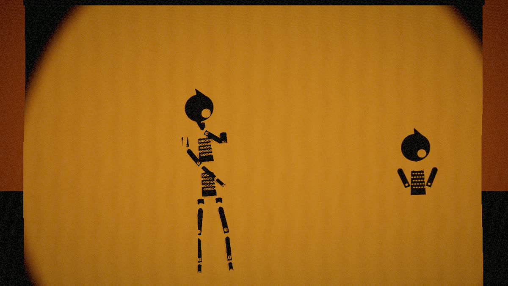

# piying-engine · 皮影戏渲染引擎

**WebGL2 shadow-puppet / 影窗 rendering engine** —— 真实阴影贴图 · 镂空透光 · 关节树 · 织物幕布

一个把「灯在幕布后面，观众看剪影」这件事**真的算出来**的渲染引擎。
不是把剪影贴上去：每个部件都是真实遮挡体，被从灯的视角渲染进 2048² 阴影贴图，
幕布上的影子是「光被挡住」的结果，镂空花纹是「光穿过孔洞」的结果。

> ### 🤖 本项目由 **deepseek-v4.1-flash** 完成



**打开方式**：双击 `index.html`（自包含单文件）。
`example/index.html` 是模块化版本，需要通过 http 打开（`npx serve .`）。
改完引擎跑 `node tools/build-single.mjs` 重新打包。

---

## 一、它能给你什么

| 能力 | 说明 |
|---|---|
| **真实遮挡投影** | 从 SpotLight 视角渲染深度图，自写深度材质在镂空处 `discard` → 孔洞真透光 |
| **可过滤的深度贴图** | 深度不打包成 RGBA，而是「距离归一化到 0..1」存进普通纹理，因此可以模糊、可以 PCF |
| **近实远虚** | 深度材质把「投射物离幕布多远」写进 B 通道，幕布据此放大采样半径 |
| **织物幕布** | 顶点级褶皱（正弦 + 分形位移，解析法线）+ 程序化经纬织纹 + 光锥/距离衰减 |
| **关节树** | `Rig` 支持任意层级关节、铰链位置、布料次级摆动（二阶阻尼弹簧） |
| **自写后期** | 三级可分离泛光 + ACES + 暖调 + 颗粒 + 暗角，无 addon 依赖 |
| **零资源** | 织物、牛皮纸、镂空花纹全部 canvas 程序化生成，不需要位图 |

## 二、快速上手

```html
<script type="importmap">{ "imports": { "three": "./vendor/three.module.js" } }</script>
<script type="module">
import { Renderer } from './src/engine/renderer.js';
import { Stage }    from './src/engine/stage.js';
import { WaveScreen } from './src/engine/screen.js';
import { Rig }      from './src/engine/rig.js';
import { makeFabricTexture, makeAlphaFromDraw } from './src/engine/textures.js';

// 1. 渲染器 → 舞台 → 幕布（顺序固定）
const renderer = new Renderer(canvas, { width: 960, height: 540 });
const stage = new Stage({ screenWidth: 4.0, screenHeight: 2.5 });
renderer.scene.add(stage.group);

const screen = new WaveScreen({ width: 4.0, height: 2.5, fabric: makeFabricTexture(1024) });
screen.bindRenderer(renderer.renderer);        // 传 three 的 WebGLRenderer
renderer.scene.add(screen.mesh);
screen.attachLight(stage.light, { shadowSize: 2048 });

// 2. 画一个部件：画到的 = 实体，destination-out 挖掉 = 镂空
const tex = makeAlphaFromDraw((ctx, w, h) => {
  ctx.fillRect(w * 0.2, h * 0.1, w * 0.6, h * 0.8);
  ctx.globalCompositeOperation = 'destination-out';
  ctx.beginPath(); ctx.arc(w * 0.5, h * 0.5, w * 0.15, 0, Math.PI * 2); ctx.fill();
}, { w: 256, h: 256 });

// 3. 装关节
const rig = new Rig();
rig.addPart({ key: 'waist', tex, w: 0.4, h: 0.5, anchor: [0, 0], pivot: [0, -0.25] });
renderer.scene.add(rig.root);

// 4. 每帧
function frame(dt) {
  rig.setPose({ waist: [0, 0, Math.sin(performance.now() / 900) * 0.1] });
  rig.update(dt);
  screen.update(dt, stage.light, renderer.camera);
  screen.renderShadow(renderer.scene);   // ★ 必须在主渲染之前
  renderer.render(dt);
}
</script>
```

完整可运行版本见 **`example/index.html`**（单文件版本 `index.html`）。

## 三、`addPart` 的坐标约定（最容易搞反的地方）

```js
rig.addPart({
  key: 'upperArmR',
  tex, w: 0.12, h: 0.26,
  parent: 'shoulderR',
  anchor: [0, -0.13],   // 关节在【父件 pivot 坐标系】里的位置
  pivot:  [0, +0.13],   // 铰链在【自己贴图】里的位置；+h/2 = 顶端，-h/2 = 底端
});
```

- `pivot` 是**旋转轴心在贴图里的位置**（原点 = 贴图中心）。顶点会平移 `-pivot`，
  所以「铰链在部件顶端」写 `[0, +h/2]`，「在底端」写 `[0, -h/2]`。
- `anchor` 是**关节相对父件 pivot 的位置**。挂在父件顶端就写父件的长度。
- **躯干链条要向上长**（每节的铰链在自己底端 `-h/2`），**四肢向下长**（铰链在顶端 `+h/2`）。
  统一用一种写法又向下堆叠，头会跑到腰的位置 —— 这是最常踩的坑。

## 四、目录

```
index.html                    自包含单文件示例（tools/build-single.mjs 生成）
example/
  index.html                  模块化示例（接自己的内容照它抄）
  main.js                     上面那个示例抽出来的脚本
src/engine/                   ★ 引擎（与内容无关，可复用）
  renderer.js                 渲染器 / HDR 目标 / 尺寸
  screen.js                   ★ 幕布着色器 + ShadowStage（阴影管线）
  materials.js                ★ 部件材质 + 自定义深度材质 + 模糊材质
  compositor.js               ★ 自写后期
  stage.js                    灯 / 剧场暗框 / 背景 / 地面
  rig.js                      ★ 关节树
  shapes.js                   镂空花纹库 + 图纸绘制机
  textures.js                 程序化织物 / 牛皮纸 / 镂空合成
src/content/                  内容层（示例用的具体造型，可整体替换）
tools/                        构建 + 无头浏览器自动化 + 像素级自检
vendor/three.module.js        three.js r160（本地化，不走 CDN）
```

## 五、自检

```bash
node tools/probe.mjs              # 像素级断言：光影/镂空透光/暖黄/织纹/动画
node tools/build-single.mjs       # 打包自包含单文件（带语法/注入/标签配对自检）
node tools/repro-user.mjs         # ★ 用不带任何特殊开关的浏览器验证 file:// 直开
node tools/verify-share-file.mjs  # ★ 复制到空目录，验证真能独立运行
node tools/gl-feedback.mjs        # 逐阶段读 gl.getError，定位 WebGL 反馈回路
```

`tools/harness.mjs` 是**零依赖**的无头浏览器驱动：自己实现了最小 CDP 客户端
（含 RFC6455 握手）与 PNG 解码器，所以整条链只需要本机装有 Chrome 或 Edge。

## 六、踩过的坑（都在代码注释里）

1. **`file://` 下 ES module 会被 CORS 拦掉。** 页面会停在静态加载文案上，JS 一行都不跑。
   更坑的是自动化测试若带了 `--allow-file-access-from-files`，这个限制会被一起绕过去，
   于是「测试全绿但用户打不开」。所以 `repro-user.mjs` 是必跑项。
2. **`castShadow` / `customDepthMaterial` 在手写阴影通道里不生效** —— 它们由 three 的
   内建阴影流程读取。必须手动换材质、手动隐藏非投射体，否则贴图里存的是显示颜色。
3. **阴影相机不在场景图里**，three 只在它自己的流程里更新它的矩阵。手写渲染必须每帧
   `position.copy(light)` + `lookAt(target)`。
4. **阴影偏移必须随场景尺度缩放，不能写死常量。** 深度区间 `[near,far]` 被压进 0..1，
   所以 1 个归一化单位 = `(far-near)` 米。写死 `0.0042` 在 `range≈3.7m` 的场景里等于
   容忍 1.5cm 深度差 —— 把皮影贴在幕布正前方 2cm 时，整个人影会被判成「受光」而消失。
   现在按物理量反算（`biasMeters / (far - near)`）。
5. **FBO 纹理的 v 轴与 NDC 相反**，采样阴影贴图要取 `(u, 1-v)`，否则剪影上下翻转。
6. **GPU 对反馈回路的判定比「源 ≠ 目标」更严**：只要被采样的纹理在之前某一趟当过渲染
   目标，就会报 feedback 并**丢弃这次 draw**（泛光静默失效）。所以泛光链需要一块专用
   暂存目标，它的纹理从头到尾只被采样。
7. **全屏四边形的正交相机 `near` 不能是 0**，否则 `w = -z = 0`、投影退化、整块被裁掉。
8. **别用字符串做模板替换**：`String.replace` 会把内容里的 `$&` / `$'` 当特殊模式，
   轻则输出错乱重则白屏。用 `replace(marker, () => text)`。
9. **`readRenderTargetPixels` 读 Float/HalfFloat 目标时可能返回全 0**（SwiftShader 实测），
   像素级验证请走 8bit 中间目标。

## 七、已知限制

- 阴影贴图是 **8bit 深度**，且只对标记了 `castShadowRaw` 的网格生效（见坑 4 的精度账）。
- 泛光是屏幕空间近似，不是体积光；远景柔化靠布料扩散 + 泊松采样，不是物理软阴影（未实现 PCSS）。
- 只在 **SwiftShader 软件光栅**下验证过，未经真机 GPU 复测。
- `example/` 里那个人物是**占位几何**：只为演示各项能力接得上，造型很粗糙。
  真实作品的造型调试在另一个项目里（`src/content/` 是它搬过来的内容层）。

## 八、关于本项目

**实现：deepseek-v4.1-flash**

从零写起：没有现成的皮影素材、没有 SVG、没有位图资源。材质与花纹是 canvas 程序化生成，
光影是真刀真枪的 shadow mapping，验收是自写的无头浏览器 + 像素级断言。

## 许可

本仓库目前**未附带开源许可证**。要复用其中代码请先开 issue 说明用途。

（`vendor/three.module.js` 是 three.js r160，MIT 许可，版权归 three.js 作者所有。）
